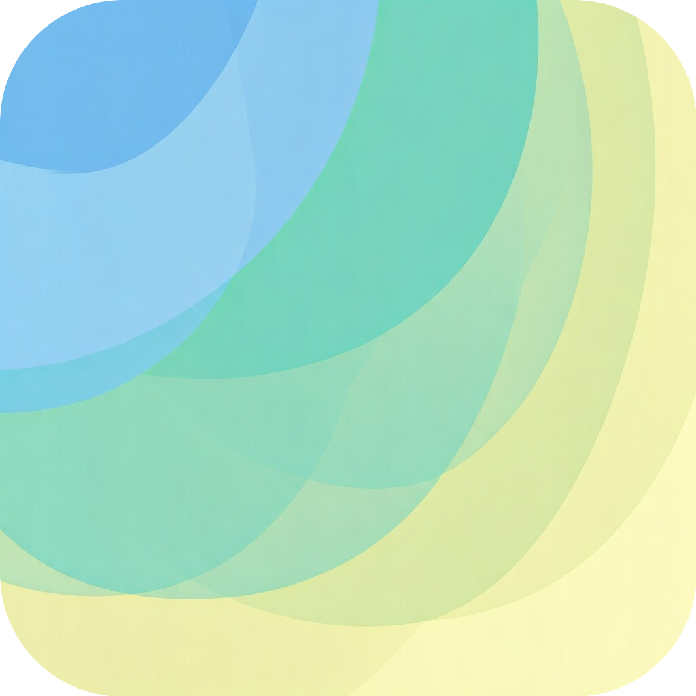
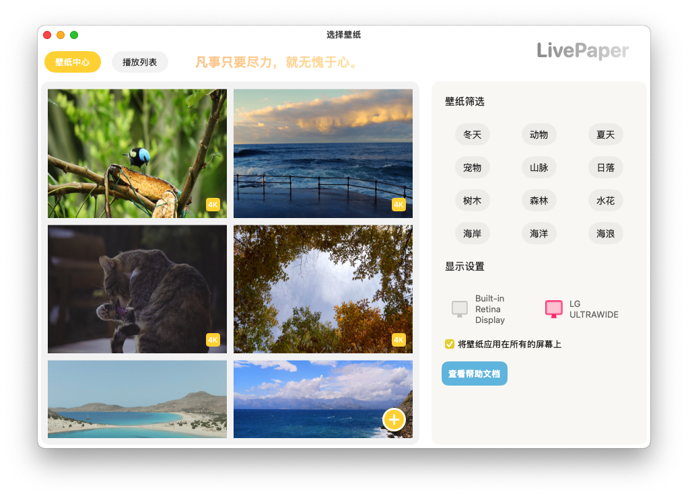
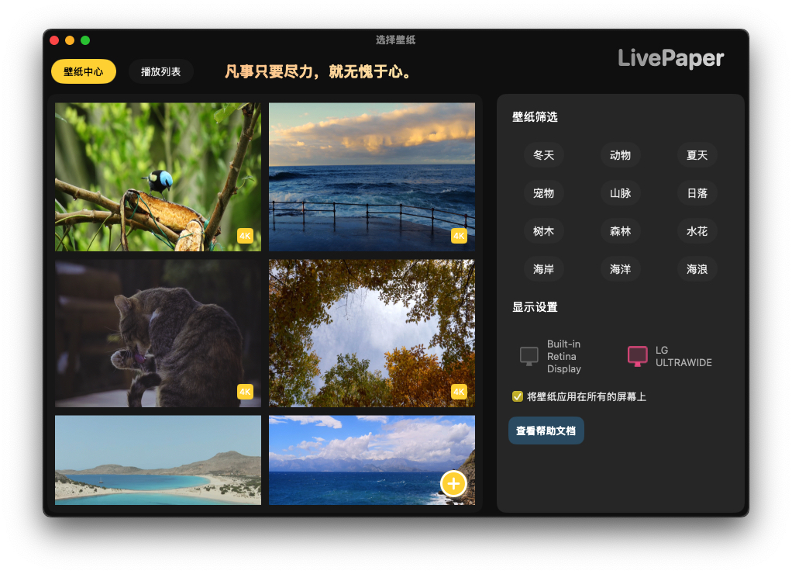

# LivePaper

LivePaper is a macOS dynamic wallpaper app developed with SwiftUI, designed to simplify the process of switching and modifying wallpapers, making it effortless to enjoy dynamic wallpapers on macOS.

[简体中文](README_CN.md) 请看这里
## Currently Supported Features
- Dynamic Video Wallpapers – Supports multiple monitors.
- Playlist Functionality – Cycle through wallpapers based on a playlist.
- Local Video Wallpaper Support – Easily add and set wallpapers with one click.
- Night Mode – Optimized for a better nighttime experience.
- Auto Start on Boot – Launch automatically when the system starts.

## Interface Display
### Light Mode

### Dark Mode

## Dynamic Effect Showcase

## Compilation and Installation
You can go to the [release page](https://github.com/LikeeCat/LikeePaper/releases) to download the latest version of the software.

This project is developed using Xcode 15 and does not currently support Swift 6.
