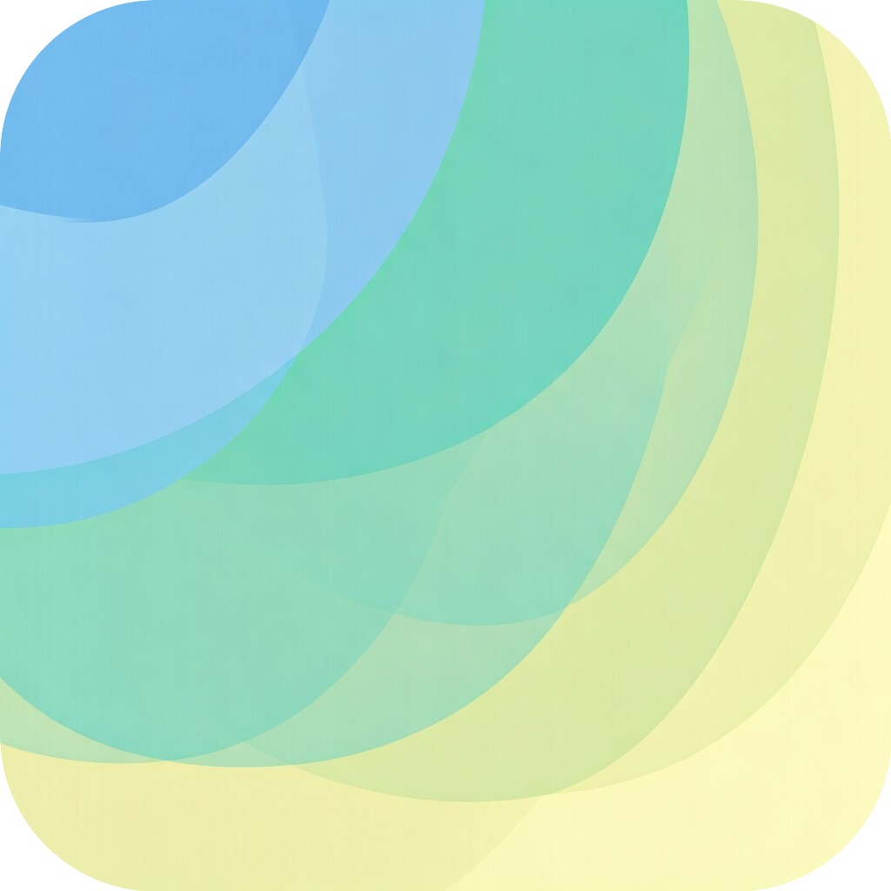
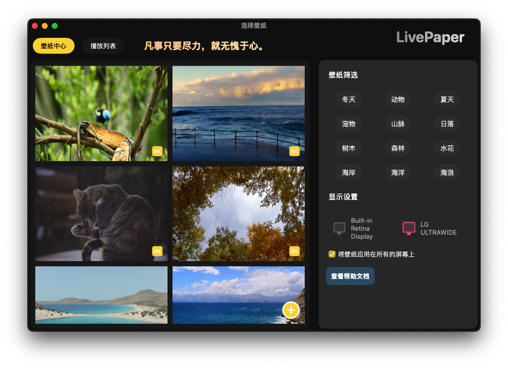

# LivePaper

这是一款基于 SwiftUI 开发的 MacOS 动态壁纸,旨在帮助大家抛弃繁琐的壁纸切换及修改流程,简单化实现 MacOS 的动态壁纸

## 目前已支持的能力
- 动态视频壁纸，支持多显示器。
- 播放列表功能——可根据播放列表循环更换壁纸。
- 支持本地视频壁纸——一键添加并设置壁纸。
- 夜间模式——针对夜间使用进行了优化。
- 开机自启动——系统启动时自动运行应用。

## 界面展示
### 亮色模式

### 暗色模式

## 动态效果展示

## 编译与安装

可以前往 [release](https://github.com/LikeeCat/LikeePaper/releases) 页面 下载软件的最新版本。

本项目使用 Xcode15 开发,暂未支持 Swift 6 新特性